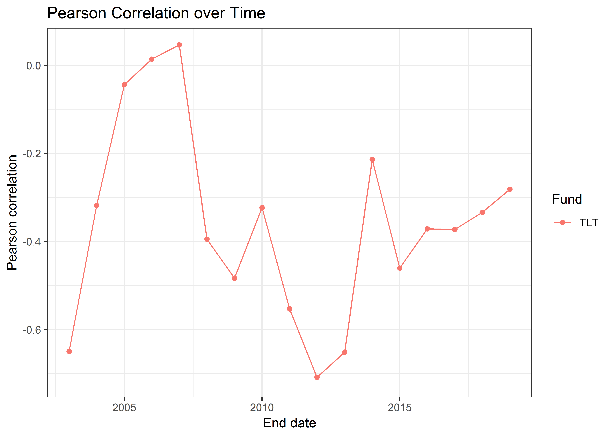
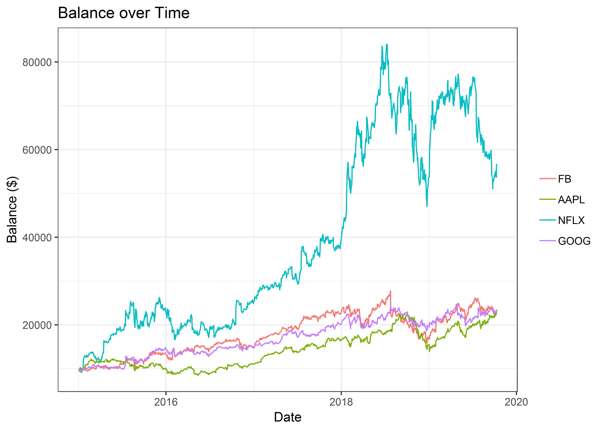

Get Rich with 'stocks'
================
Dane Van Domelen <br> <vandomed@gmail.com>
2019-10-11

<!-- README.md is generated from README.Rmd. Please edit that file -->
[](https://travis-ci.org/vandomed/stocks)

'stocks' package
----------------

The **stocks** package has a variety of functions for analyzing investments and investment strategies. I use it for a lot of my articles on [Seeking Alpha](https://seekingalpha.com/author/dane-van-domelen/articles#regular_articles). The package relies heavily on [Yahoo! Finance](https://finance.yahoo.com/) for historical prices and on the **quantmod** package for downloading that data into R.

There are functions for calculating performance metrics, visualizing the performance of funds and multi-fund portfolios, and backtesting trading strategies. The main functions are:

<table>
<colgroup>
<col width="33%" />
<col width="66%" />
</colgroup>
<thead>
<tr class="header">
<th align="left">Function</th>
<th align="left">Purpose</th>
</tr>
</thead>
<tbody>
<tr class="odd">
<td align="left"><code>load_prices</code></td>
<td align="left">Download Historical Prices for a Set of Tickers</td>
</tr>
<tr class="even">
<td align="left"><code>load_gains</code></td>
<td align="left">Download Historical Gains for a Set of Tickers</td>
</tr>
<tr class="odd">
<td align="left"><code>plot_growth</code></td>
<td align="left">Plot Growth of Investments</td>
</tr>
<tr class="even">
<td align="left"><code>calc_metrics</code></td>
<td align="left">Calculate Performance Metrics</td>
</tr>
<tr class="odd">
<td align="left"><code>calc_metrics_overtime</code></td>
<td align="left">Calculate Performance Metrics over Time</td>
</tr>
<tr class="even">
<td align="left"><code>calc_metrics_2funds</code></td>
<td align="left">Calculate Performance Metrics for Two-Fund Portfolios with Varying Allocations</td>
</tr>
<tr class="odd">
<td align="left"><code>calc_metrics_3funds</code></td>
<td align="left">Calculate Performance Metrics for Three-Fund Portfolios with Varying Allocations</td>
</tr>
<tr class="even">
<td align="left"><code>plot_metrics</code></td>
<td align="left">Plot One Performance Metric (Sorted Bar Plot) or One Performance Metric vs. Another (Scatterplot)</td>
</tr>
<tr class="odd">
<td align="left"><code>plot_metrics_overtime</code></td>
<td align="left">Plot One Performance Metric vs. Time or One Performance Metric vs. Another over Time</td>
</tr>
<tr class="even">
<td align="left"><code>plot_metrics_2funds</code></td>
<td align="left">Plot One Performance Metric vs. Time or One Performance Metric vs. Another over Time</td>
</tr>
<tr class="odd">
<td align="left"><code>plot_metrics_3funds</code></td>
<td align="left">Plot One Performance Metric vs. Another for a Three-Fund Portfolio with Varying Allocations</td>
</tr>
</tbody>
</table>

Motivating example: A two-fund stocks and bonds portfolio
---------------------------------------------------------

### Rationale

Stocks and bonds are obviously the primary building blocks for a retirement portfolio, and I think the ETF's SPY and TLT pair together very nicely for a very effective two-fund strategy. Let's look at the performance of these funds separately and together.

### Assess each fund's performance over their mutual lifetimes

We can use *load\_gains* to download historical daily gains for SPY and TLT over their mutual lifetimes:

``` r
library("stocks")
gains <- load_gains(c("SPY", "TLT"), mutual.start = TRUE, to = "2018-12-31")
head(gains)
#>            Date     SPY     TLT
#> 2395 2002-07-31  0.0024  0.0124
#> 2396 2002-08-01 -0.0261  0.0057
#> 2397 2002-08-02 -0.0224  0.0102
#> 2398 2002-08-05 -0.0348  0.0044
#> 2399 2002-08-06  0.0337 -0.0085
#> 2400 2002-08-07  0.0174  0.0024
```

We can call (or pipe into) *calc\_metrics* to calculate some performance metrics. `calc_metrics` returns a normal data frame, but I'll call `knitr::kable` to print it as a neat-looking table:

``` r
metrics <- calc_metrics(gains)
knitr::kable(metrics)
```

| Fund |  Mean (%)|  SD (%)|  Growth (%)|  CAGR (%)|  Max drawdown (%)|  Sharpe ratio|  Sortino ratio|  Alpha (%)|  Annualized alpha (%)|   Beta|  R-squared|  Pearson corr.|  Spearman corr.|  Pearson autocorr.|  Spearman autocorr.|
|:-----|---------:|-------:|-----------:|---------:|-----------------:|-------------:|--------------:|----------:|---------------------:|------:|----------:|--------------:|---------------:|------------------:|-------------------:|
| SPY  |      0.04|    1.17|         281|       8.5|                55|          0.03|           0.04|       0.00|                     0|   1.00|       1.00|            1.0|            1.00|              -0.08|               -0.05|
| TLT  |      0.03|    0.84|         173|       6.3|                27|          0.03|           0.05|       0.04|                    10|  -0.29|       0.16|           -0.4|           -0.34|              -0.04|               -0.05|

We see here that SPY has achieved stronger growth (8.5% vs. 6.3%), but with a much worse max drawdown (55.2% vs. 26.6%). TLT's Sharpe ratio (a measure of risk-adjusted returns) is somewhat higher than SPY's.

Without getting too far ahead of myself, TLT's positive alpha (0.04%) and negative beta (-0.29) are precisely why it pairs so well with SPY. This isn't unique to TLT; all bond funds should generate alpha (otherwise, don't invest!), and they're often negatively correlated with equities.

For a visual comparison of the returns and volatility of these two ETF's, we can plot mean vs. SD using `plot_metrics`.

``` r
plot_metrics(metrics, mean ~ sd)
```


No surprise, the S&P 500 ETF had more growth, but also higher volatility.

(Side note: You could achieve the same plot by specifying `gains` rather than `metrics`, or by simply specifying the `tickers` input.)

### How reliable is TLT's negative correlation?

Negative correlation works wonders for a two-fund portfolio, so let's look at how consistently TLT achieves negative correlation with SPY, using `calc_metrics_overtime` and `plot_metrics_overtime`. For illustrative purposes, I'll include the full 3-step process: load historical gains, calculate beta over time, and plot beta over time.

``` r
c("SPY", "TLT") %>%
  load_gains(to = "2018-12-31") %>%
  calc_metrics_overtime("pearson") %>%
  plot_metrics_overtime(pearson ~ .)
```



While the tendency is certainly for negative correlation, there's a lot of variability, and in some years the correlation was actually slightly positive.

As you can see, the default behavior is to calculate the requested metric on a per-year basis. You can also request per-month calculations or rolling windows of a certain width (see `?calc_metrics_overtime`). And the Pearson correlation is just one of many metrics you can plot (see `?calc_metrics` for the full list).

Everyone loves piping these days, but for typical use cases I would actually recommend skipping directly to `plot_metrics_overtime`. If you specify `tickers`, it will download the data it needs on the fly. This code is much shorter and produces the same figure as above:

``` r
plot_metrics_overtime(formula = beta ~ ., tickers = "TLT")
```

### A 50-50 blend

A 50% SPY, 50% TLT portfolio should generate much better risk-adjusted returns than SPY (and perhaps TLT) itself, but a 50% bonds allocation is pretty high so raw returns will probably be lower.

To look at this, we can add a column to `gains` and then call `calc_metrics`, requesting a few particular metrics:

``` r
gains$`50-50` <- gains$SPY * 0.5 + gains$TLT * 0.5
calc_metrics(gains, c("cagr", "mdd", "sharpe", "sortino")) %>%
  knitr::kable()
```

| Fund  |  CAGR (%)|  Max drawdown (%)|  Sharpe ratio|  Sortino ratio|
|:------|---------:|-----------------:|-------------:|--------------:|
| SPY   |       8.5|                55|          0.03|           0.04|
| TLT   |       6.3|                27|          0.03|           0.05|
| 50-50 |       8.4|                23|          0.06|           0.08|

Indeed, while the 50-50 portfolio achieved slightly lower raw returns than SPY alone (8.4% vs. 8.5% annualized), its max drawdown was far better, and its Sharpe and Sortino ratios indicated much better risk-adjusted growth compared to the individual ETF's.

### What's the optimal allocation?

That will likely depend on what metric you want to maximize. In terms of raw growth, roughly 75% SPY is optimal, but the curve is pretty flat--the CAGR is roughly the same from 60-100% SPY.

``` r
plot_metrics_2funds(gains = gains, 
                    formula = cagr ~ allocation, 
                    tickers = c("SPY", "TLT"))
```


In terms of risk-adjusted growth, the Sharpe ratio curve is somewhat more interesting. The maximum Sharpe ratio occurs around 40% SPY, and the Sharpe ratio gets much worse as you approach 60% SPY and higher.

``` r
plot_metrics_2funds(gains = gains, 
                    formula = sharpe ~ allocation, 
                    tickers = c("SPY", "TLT"))
```


We can gain additional insight by plotting two metrics against each other, across all possible allocations. A common strategy is to plot the mean vs. standard deviation as a function of the allocation:

``` r
plot_metrics_2funds(gains = gains, 
                    formula = mean ~ sd, 
                    tickers = c("SPY", "TLT"))
```


This plot yields an interesting finding: starting at 100% TLT, increasing the allocation to SPY simultaneously *reduces volatility* and *increases returns*. In other words, you'd be crazy not to ride the curve up and to the left, adding at least a 30% SPY allocation.

A big caveat is that this is all based on historical data. There's no guarantee that 30% SPY, 70% TLT will have lower volatility *or* greater returns than TLT going forward.

Three-fund portfolios, plus a stock tip
---------------------------------------

I won't go into detail about it here, but one of my favorite strategies is UPRO-VBLTX-VWEHX. [UPRO](https://www.proshares.com/funds/upro.html) is a 3x daily S&P 500 ETF and VBLTX and VWEHX are two bonds mutual funds offered by Vanguard.

To visualize the behavior of this 3-fund portfolio, let's plot mean vs. SD as the allocations vary.

``` r
plot_metrics_3funds(formula = mean ~ sd, 
                    tickers = c("VWEHX", "VBLTX", "UPRO"))
```


By default, SPY is included on the plot, so you can compare metrics to the S&P. Notice that many points on the UPRO-VBLTX-VWEHX surface are higher and to the left of SPY, meaning this strategy has the potential to trump the S&P in terms of risk-reward.

One idea would be to choose an allocation to match the volatility (i.e, SD) of SPY. At roughly 1% SD, it looks like the higher black curve, which is just UPRO-VBLTX (0% VWEHX), achieves the highest historical returns. Still, I like having VWEHX in there for a second source of alpha.

To see the actual numbers, you can either specify `return = "data"` (or `return = "both"`), or inptu the plot returned by `plot_metrics_3funds` to `plotly::ggplotly`.

I'll close it out with a hot stock tip: buy FANG.

``` r
plot_growth(tickers = c("FB", "AAPL", "NFLX", "GOOG"), from = "2015-01-01")
```



<!-- ## Conclusions -->
<!-- Hopefully this gives you a good idea of the main functions in **stocks**. There are a lot of options I didn't cover, especially for the graphics functions. You can read about these options by looking at the relevant help files (e.g. run `?twofunds_graph` in R). Please feel free to e-mail me at <vandomed@gmail.com> with questions or suggestions, or, better yet, contribute to the project on [GitHub](https://github.com/vandomed/stocks). -->
<!-- ## Version history -->
<!-- | Version                   |Notes -->
<!-- |:--------------------------|:----------------------------------------------------- -->
<!-- |1.0-1.5                    |Original -->
<!-- |2.0                        |Switched from base R to ggplot (slower but better) -->
<!-- |                           |Added support for piping -->
<!-- |                           |Simplified functions to calculate performance metrics -->
<!-- ## References -->
Peterson, Brian G., and Peter Carl. 2014. *PerformanceAnalytics: Econometric Tools for Performance and Risk Analysis*. <https://CRAN.R-project.org/package=PerformanceAnalytics>.

Ryan, Jeffrey A., and Joshua M. Ulrich. 2017. *Quantmod: Quantitative Financial Modelling Framework*. <https://CRAN.R-project.org/package=quantmod>.

Xie, Yihui. 2017. *Printr: Automatically Print R Objects to Appropriate Formats According to the ’Knitr’ Output Format*. <https://CRAN.R-project.org/package=printr>.
